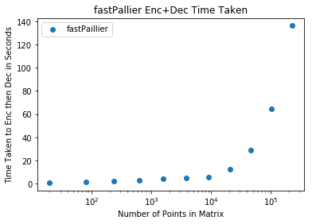

Fast Paillier
~~~~~~~~~~~~~

Introduction to the Paillier Cryptosystem
^^^^^^^^^^^^^^^^^^^^^^^^^^^^^^^^^^^^^^^^^

The Paillier cryptosystem is an probabilistic asymmetric algorithm for
public key cryptography, designed in 1999 by Pascal Paillier.

This cryptosystem has the important property that it is homomorphic in
its addition operator. Explicitly, if :math:`\alpha`, :math:`\beta`, and
:math:`\xi` are scalars, :math:`a` and :math:`b` are two plaintexts, and
:math:`Enc(a)`, :math:`Enc(b)` are the encryption of :math:`a` and
:math:`b` under the same public key, then
:math:`D(\alpha E(a) + \beta E(b) + \xi) = \alpha D(E(a)) + \beta D(E(b)) + \xi`
where :math:`D` is the decryption under the secret key. This means that
operations of scalar multiplication, scalar addition, and element-wise
addition in the ciphertext-space are preserved in the message-space
after encryption.

This means that an untrusted third party could perform a limited set of
computations on the encrypted data without ever finding out what the
data is. For example, Alice could generate a key pair :math:`(p, s)` and
send Bob a list of numbers :math:`X = [x_1, x_2, \ldots, x_n]` encrypted
under her public key,
:math:`E_p(X) = [E_p(x_1), E_p(x_2), \ldots, E_p(x_n)]`. She could then
ask Bob to take the mean of these numbers and return the result
:math:`S = \frac{1}{n} \sum_{i = 1}^n E_p(x_i)`. Bob learned nothing
about the :math:`X` from doing this, but given :math:`S`, Alice could
compute
:math:`D_s(S) = D_s(\frac{1}{n}\sum_{i=1}^nE_p(x_i)) = \frac{1}{n}\sum_{i=1}^nD_s(E_p(x_i)) = \frac{1}{n}\sum_{i=1}^n x_i`
and obtain the correct mean value.

Vector Operations with Paillier
^^^^^^^^^^^^^^^^^^^^^^^^^^^^^^^

Suppose :math:`x \in \mathbb{Z}^D` is a :math:`D`-dimensional vector. We
can extend the Paillier cryptosystem to do some structure preserving
operations on vectors.

Suppose again Alice has a key pair :math:`(p, s)`. If
:math:`\vec{x} = [x_1, x_2, \ldots, x_D]^T`, we can define
:math:`E_p(\vec{x}) = [E_p(x_1), E_p(x_2), \ldots, E_p(x_D)]^T`. With
this definition, we can perform similar operations to those described in
the indroduction on vectors instead of values in :math:`\mathbb{R}`. For
example, if
:math:`X = \big( \, \vec{x_1} \big| \vec{x_2} \big| \ldots \big| \vec{x_n} \, \big)`
is a matrix in :math:`\mathbb{R}^{D \times n}`, Alice can encrypt this
entire matrix by encrypting each vector individually. Then Alice can
send the encrypted matrix
:math:`E_p(X) = \big( \, E_p(\vec{x_1}) \big| E_p(\vec{x_2}) \big| \ldots \big| E_p(\vec{x_n}) \, \big)`
to Bob and have him compute the row-wise mean
:math:`E_p(\vec{\mu}) = \frac{1}{n}\sum_{i = 1}^n E_p(\vec{x}_i)`.
Finally, Alice can decrypt :math:`D_s(E_p(\vec{\mu})) = \vec{\mu}` to
get the result.

Inefficiencies with Small Messages
^^^^^^^^^^^^^^^^^^^^^^^^^^^^^^^^^^

The encryption operation :math:`E_p(m)` in the Paillier cryptosystem is
explicitely :math:`E_p(m) = g^m r^n \mod n^2` where
:math:`g \in \mathbb{Z}_{n^2}^*` and :math:`r \in \mathbb{Z}` is a
random number.

Since the secret key :math:`s` is easy to compute with the factorization
of :math:`N = pq`, like in RSA, we must choose large moduli (e.g. N =
2048 bits) to avoid brute force factoring attacks. But according to the
original paper, the Paillier cryptosystem is safe to use with plaintexts
:math:`m \in \mathbb{Z}^{\frac{N}{3} - 1}`. This leads to major
inefficiencies in some specific use cases. Here is an example of the
problem:

Suppose Alice now has a matrix :math:`M \in \{0, 1\}^{\{D, n\}}` where
:math:`D >> n` and :math:`n << N`. This is a common setting in Genomic
studies, where :math:`D \approx 28e6`, :math:`n \approx 100`, and
:math:`M_{i, j} = 1` if subject :math:`j` has mutation :math:`i`, else
:math:`0`.

If Alice wants to now find the the row sum of her data (the count of
each mutation in the entire cohort of :math:`n` subjects), she will need
to perform the expensive encryption operation on every entry in the
matrix :math:`M` even though she only required :math:`N` to avoid brute
force attacks and is not at all taking advantage of the fact that the
encryption scheme works for values in
:math:`m \in \mathbb{Z}^{\frac{N}{3} - 1}` (since the highest possible
value she can have in her result is :math:`100`).

Empirically, we can see the this is a large slow down.

.. code:: ipython3

    from phe import paillier
    import numpy as np
    import sys
    sys.path.append('..')
    import gphe.vecphe as vphe
    p, s = paillier.generate_paillier_keypair()
    D, n = (128, 4)
    M = np.random.binomial(1, .5, (D, n))
    print("(D, n) =", (D, n))


.. parsed-literal::

    (D, n) = (128, 4)


.. code:: ipython3

    %%time
    E_Mslow = vphe.matEnc(p, M)


.. parsed-literal::

    CPU times: user 30.7 s, sys: 29 ms, total: 30.7 s
    Wall time: 30.9 s


.. code:: bash

    %%bash
    screenfetch


.. parsed-literal::

                              ./+o+-       ryan@galliumos
                      yyyyy- -yyyyyy+      OS: Ubuntu 16.04 xenial
                   ://+//////-yyyyyyo      Kernel: x86_64 Linux 4.9.4-galliumos-braswell
               .++ .:/++++++/-.+sss/`      Uptime: 3h 48m
             .:++o:  /++++++++/:--:/-      Packages: 1830
            o:+o+:++.`..```.-/oo+++++/     Shell: bash 4.3.48
           .:+o:+o/.          `+sssoo+/    Resolution: 1920x1080
      .++/+:+oo+o:`             /sssooo.   DE: XFCE
     /+++//+:`oo+o               /::--:.   WM: Xfwm4
     \+/+o+++`o++o               ++////.   WM Theme: Arc-Darker-GalliumOS
      .++.o+++oo+:`             /dddhhh.   GTK Theme: Arc-GalliumOS [GTK2]
           .+.o+oo:.          `oddhhhh+    Icon Theme: Numix-Circle-GalliumOS
            \+.++o+o``-````.:ohdhhhhh+     Font: Roboto 10
             `:o+++ `ohhhhhhhhyo++os:      CPU: Intel Celeron CPU N3160 @ 1.601GHz
               .o:`.syhhhhhhh/.oo++o`      RAM: 1747MiB / 3900MiB
                   /osyyyyyyo++ooo+++/    
                       ````` +oo+++o\:    
                              `oo++.      


As you can see, the process of encrypting such a matrix where
:math:`D = 128` and :math:`n = 4` (which is very small) takes 30
seconds. Even on better hardware (as you can see, we are not working
with a powerhouse here), it is unlikely that a larger genomic study
where :math:`D` is in the millions and :math:`n` is in the hundreds is
going to finish any time soon.

Speeding Things Up
^^^^^^^^^^^^^^^^^^

The reason this experiment went so poorly is because our data structure
was not taking advantage of the large amount of numbers encrypted values
could take on. We fix this as follows:

Consider the mapping

.. math:: f_{b, l}: \{0, 1\}^{\{D, n\}} \rightarrow \mathbb{Z}^{\{d, n\}}

parameterized by a base size variable :math:`b` and a block length
variable :math:`l`. We define

.. math:: g_{b}: \{0, 1\}^l \rightarrow \mathbb{Z}_b, \,\, g(\vec{x}) = \sum_{i = 0}^{l - 1} x_{i + 1} b^i

 and

.. math:: z_{b, l}: \{0, 1\}^{l, n} \rightarrow \mathbb{Z}_b^n, \,\, z_b(M, i) = [g_{b}(M[i:i+l, 1]), g_{b}(M[i:i+l, 1]), \ldots, g_{b}(M[i:i+l, n])]

.

We take

.. math:: f_{b, l}(M) = \bigg(z_{b, l}(M, 0)^T, z_{b, l}(M, l)^T, \ldots, z_{b, l}(M, \frac{n}{l})^T  \bigg)^T

The point here is that :math:`f` is an isomorphism since :math:`g` is
invertible, but :math:`d << D`.

We test this experiment with: \* :math:`b = 128` \* :math:`l = 128` \*
:math:`D = 128` \* :math:`n = 4` \* :math:`d = 4`

.. code:: ipython3

    %%time
    E_Mfast = vphe.fmatEnc(p, M)


.. parsed-literal::

    CPU times: user 1.13 s, sys: 29 ms, total: 1.15 s
    Wall time: 1.21 s


As we can see, this new encryption scheme ran much faster at at over a
1000x speedup. Decryption time is also improved with this scheme, as we
can see below.

.. code:: ipython3

    %%time
    Mslow = vphe.matDec(s, E_Mslow)


.. parsed-literal::

    CPU times: user 8.76 s, sys: 12 ms, total: 8.77 s
    Wall time: 8.95 s


.. code:: ipython3

    %%time
    Mfast = vphe.fmatDec(s, E_Mfast)


.. parsed-literal::

    CPU times: user 82 ms, sys: 1 ms, total: 83 ms
    Wall time: 89.8 ms


We see a similar speedup of around 1000x. Now we check to see if the
decrypted matrices are actually the same.

.. code:: ipython3

    assert all( Mslow.flatten() == Mfast.flatten())

Now we run several tests to see how the Encryption plus Decryption times
very as a function of the number of points in the matrix for the Fast
and Slow schemes. We plot the results below.

.. code:: ipython3

    import time
    Ds = [2**x for x in range(1, 6)]
    ns = [10 * x for x in range(1, 6)]
    slowtimes = []
    fasttimes = []
    numpoints = []
    for D, n in zip(Ds, ns):
        numpoints.append(D * n)
        M = np.random.binomial(1, .5, (D, n))
        
        start = time.time()
        E_Mslow = vphe.matEnc(p, M)
        Mslow = vphe.matDec(s, E_Mslow)
        end = time.time()
        slowtimes.append(end - start)
        
        start = time.time()
        E_Mfast = vphe.fmatEnc(p, M)
        Mfast = vphe.fmatDec(s, E_Mfast)
        end = time.time()
        fasttimes.append(end - start)

.. code:: ipython3

    import seaborn as sns
    import matplotlib.pyplot as plt
    plt.scatter(numpoints, slowtimes, label="Pallier")
    plt.scatter(numpoints, fasttimes, label="fastPaillier")
    plt.xlabel("Number of Points in Matrix")
    plt.ylabel("Time Taken to Enc then Dec in Seconds")
    plt.xscale("log")
    plt.title("Pallier Enc+Dec vs. fastPallier Enc+Dec")
    plt.legend()
    plt.show()


.. image:: output_16_0.png


We see that the fastPaillier schemes is performing much better than the
normal Paillier scheme. We continue the fastPaillier plot since it is
not prohibatively long, and see the general trend of the fast scheme.

.. code:: ipython3

    Ds = [2**x for x in range(6, 12)]
    ns = [10 * x for x in range(6, 12)]
    for D, n in zip(Ds, ns):
        numpoints.append(D * n)
        M = np.random.binomial(1, .5, (D, n))
        
        start = time.time()
        E_Mfast = vphe.fmatEnc(p, M)
        Mfast = vphe.fmatDec(s, E_Mfast)
        end = time.time()
        fasttimes.append(end - start)

.. code:: ipython3

    plt.scatter(numpoints, fasttimes, label="fastPaillier")
    plt.xlabel("Number of Points in Matrix")
    plt.ylabel("Time Taken to Enc then Dec in Seconds")
    plt.xscale("log")
    plt.title("fastPallier Enc+Dec Time Taken")
    plt.legend()
    plt.show()





Matrix Operations
~~~~~~~~~~~~~~~~~

Now, we demonstrate some matrix operations which can be computed on the
encrypted data.

.. code:: ipython3

    D, n = (4, 2)
    M = np.random.binomial(1, .5, (D, n))
    print("(D, n) =", (D, n))
    E_Mfast = vphe.fmatEnc(p, M, block=4)
    M


.. parsed-literal::

    (D, n) = (4, 2)


.. parsed-literal::

    array([[0, 1],
           [0, 0],
           [0, 0],
           [1, 0]])


Row Sum and Mean
''''''''''''''''

.. code:: ipython3

    Encrypted_Row_Sum = vphe.matRowSum(E_Mfast)

.. code:: ipython3

    sm = vphe.fvecDec(s, Encrypted_Row_Sum, block = 4)
    print("sum", sm)
    print("mean", [x/n for x in sm])


.. parsed-literal::

    sum [1, 0, 0, 1]
    mean [0.5, 0.0, 0.0, 0.5]


Weighted Row Sum and Mean
'''''''''''''''''''''''''

.. code:: ipython3

    Encrypted_Weighted_Row_Sum = vphe.matRowWeightedSum(E_Mfast, [2, 4])

.. code:: ipython3

    sm = vphe.fvecDec(s, Encrypted_Weighted_Row_Sum, block = 4)
    print("sum", sm)
    print("mean", [x/n for x in sm])


.. parsed-literal::

    sum [4, 0, 0, 2]
    mean [2.0, 0.0, 0.0, 1.0]


Dot Product with Scalar Matrix
''''''''''''''''''''''''''''''

.. code:: ipython3

    N = np.array([[1, 2, 3, 4], [5, 6, 7, 8]], int)
    print("Scalar Matrix")
    print(N)
    Encrypted_Dot_Product = vphe.matDotProduct(E_Mfast, N)


.. parsed-literal::

    [[1 2 3 4]
     [5 6 7 8]]


.. code:: ipython3

    sm = [vphe.fvecDec(s, E, block = 4) for E in Encrypted_Dot_Product]
    print(M)
    print("dot product with")
    print(N)
    print("is")
    print(np.array(sm, int))


.. parsed-literal::

    [[0 1]
     [0 0]
     [0 0]
     [1 0]]
    dot product with
    [[1 2 3 4]
     [5 6 7 8]]
    is
    [[5 0 0 1]
     [6 0 0 2]
     [7 0 0 3]
     [8 0 0 4]]


Applications to Genomics
~~~~~~~~~~~~~~~~~~~~~~~~

Suppose we have a :math:`D` by :math:`n` matrix where :math:`D` is the
number of possible genetic mutations considered in a population and
:math:`n` is the number of people in the population.

Further, suppose :math:`n` is relatively small (<100) and each sample
point is a person with some genetic disorder.

A simple test to figure out which mutation is the likely cause of the
disorder in the population is to find the mutation with the highest
count across the population (e.g., the row sum of the :math:`D` by
:math:`n` matrix).

While an operation like this would not require outsourcing computation
to the cloud (which is a common application of partially or fully
homomorphic encryption schemes), this property does allow for a
scientific convenience. Since genetic data is protected, scarce, and
valuable, scientific bodies often do not make the data public.

The Paillier scheme allows for this simple counting test to be
accomplished on a set of shared data from :math:`k` scientific groups,
where each group only knows the true values of their own data. This can
be done as follows:

Suppose at a meeting (conference, ect.), :math:`k` groups meet up and
generate a public / private key pair. The private key is split into
:math:`k` chunks and each group gets a chunk of the private key (we can
blow up the private key to :math:`k` times its original size, so that
even if :math:`k-1` of the organizations are in cahoots, they could not
guess the :math:`k`'th organizations private key).

With this setup, they could keep a public database with the
concatenation of all :math:`k` groups data encrypted under the public
key. Then, they can at any point come to an aggreement to sum together
all of the rows of the database and decrypt the result. They can all
find out the result, but without one group doing something shady at a
group meeting and stealing everyone else's private keys, no one group
can know all of the raw data that was used to produce the sum.
